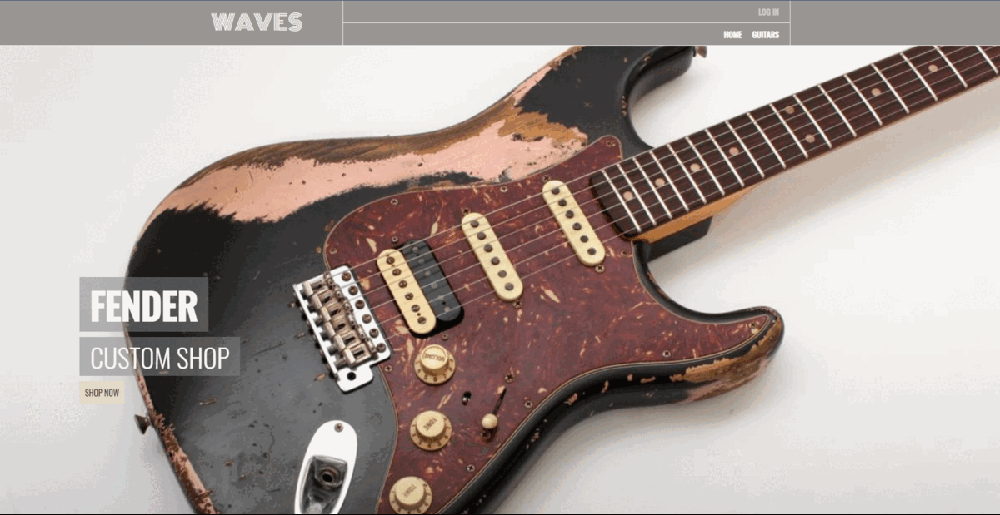

# Waves🎸

🚀 [Live Version](https://waves-guiters.herokuapp.com/ "Waves"): https://waves-guiters.herokuapp.com/

---

📃 Description:

    Waves is an e-commerce platform for selling guitars where users can find their preferred guitars.

---

⚙️ Technologies:

    Frontend: HTML, CSS, JavaScript, React, Redux
    Backend: Node.js, ExpressJS
    Database: MongoDB

---

📷 Screen Shots:

